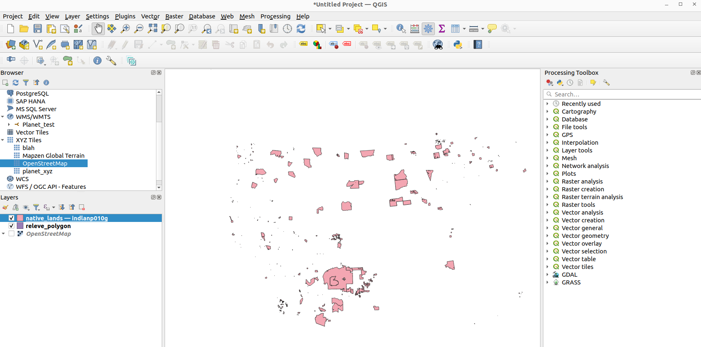

## Cloud-Native Vector Format?

There are a few different vector formats that are used to represent spatial data across the web. Many are in active development to be considered 'cloud-native' (i.e., streamable across http). None have acheived wide adoption yet. For a great description on cloud-native vector candidates check out this [blog](https://cholmes.medium.com/an-overview-of-cloud-native-vector-c223845638e0){target=_blank} by Chris Holmes. 

Here are some of these vector formats:

## [Flatgeobuf](http://flatgeobuf.org/){target=_blank}

I have an example Flatgeobuf file located [here](https://data.cyverse.org/dav-anon/iplant/home/jgillan/Jeffs_stuff/native_lands_GIS/native_lands.fgb){target=_blank} in Cyverse Data Store. It represents native lands in the USA. You should be able to stream this file in QGIS or ArcGIS Pro.


<figure markdown>
  { width="800" }
  <figcaption>Flatgeobuf file of native lands streamed into QGIS </figcaption>
</figure>

### Create a Flatgeobuf file using GDAL

For installing and using [GDAL](https://gdal.org/){target=_blank} see this [guide](cog.md#creating-your-own-cogs).

```
ogr2ogr -f FlatGeobuf -lco SPATIAL_INDEX=YES -nlt PROMOTE_TO_MULTI native_lands.fgb indlanp010g.shp
```

Check out this [blog](https://worace.works/2022/02/23/kicking-the-tires-flatgeobuf/){target=_blank} to learn more on the technical details of Flatgeobuf.
</br>
</br>

## [GeoParquet](https://geoparquet.org/){target=_blank}

</br>

## [Geopackage](https://www.geopackage.org/){target=_blank}
