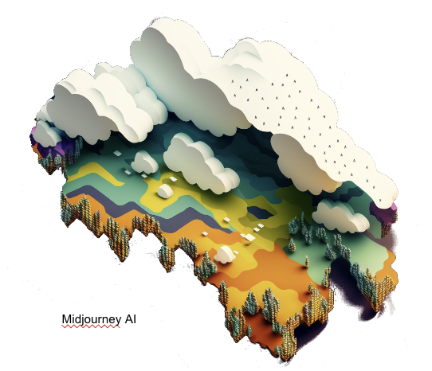
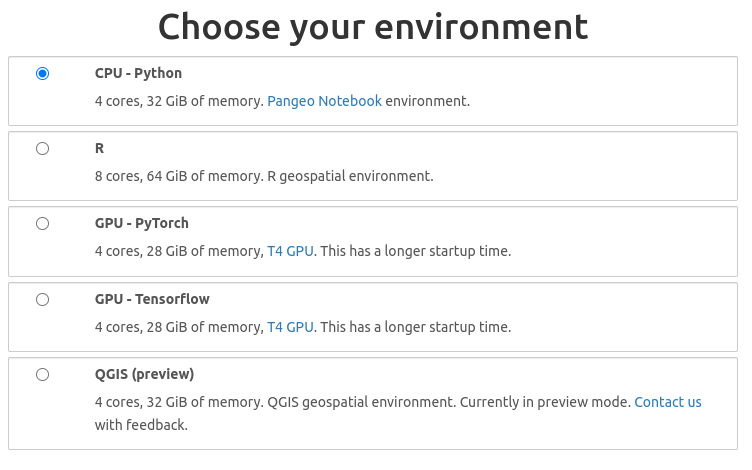

{ width="300" align="right" }

As mentioned in the [introduction](index.md#cloud-compute), cloud computing is all about moving geospatial analysis and computation from your local machine to a remote machine in the cloud. This approach has several advantages over traditional desktop computing.

!!! Success "Advantages of Cloud Computing"
        
        * With cloud computing, you can avoid the upfront cost and complexity of owning and maintaining your own IT infrastructure
        * Cloud computing allows groups or individuals to scale up (or down) their operations quickly as their computing needs change
        * Cloud computing allows users to access their data and applications from anywhere, on any device, at any time
        * Geospatial in the cloud empowers colleagues to work directly together on the same data, models, and applications. The same way that [Google Docs](https://www.google.com/docs/about/){target=_blank} allows multiple people to work on the same document at the same time

___

### Google Earth Engine

<a href="https://earthengine.google.com/ style="float:left" target="blank" rel="app">{ width="100" } </a>

Google Earth Engine is a cloud-based platform that enables users to process and analyze geospatial data. It provides access to a massive collection of satellite imagery, weather data, and other geospatial datasets. Users can use Earth Engine to visualize data, create maps, and run geospatial analysis. This [video](https://www.youtube.com/watch?v=HofrUehuEk4){target=_blank} gives a gentle introduction to GEE and is aimed at non-coders.

Here are some of the key features of GEE:

* 70 pb and 800+ curated [geospatial datasets](https://developers.google.com/earth-engine/datasets){target=_blank}, including 40 years of satellite imagery. Check out [Awesome GEE Community Data Catalog](https://gee-community-catalog.org/){target=_blank} for a curated list of community contributed datasets.

* Cloud-based processing: Earth Engine is a cloud-based platform, so users can process data without having to worry about setting up or maintaining their own infrastructure. This makes it easy to get started with Earth Engine and to scale your analysis as needed.

* Code can be worked on collaboratively. You can share your code with others, and you can also use Earth Engine to work on code together in real-time.

* 250 GB of free storage for your own data

* Executing commands occurs in a Javascript code editor, but you can also use the GEE Python [library](https://developers.google.com/earth-engine/guides/python_install){target=_blank} to interact with GEE from your IDE

* You can create GEE 'apps' which are basically mini web sites to interact with data. Check out this [example app showcasing drone imagery](https://bit.ly/srer-drone-2019){target=_blank}.

* You can [import](https://developers.google.com/earth-engine/guides/image_overview){target=_blank} and [export](https://developers.google.com/earth-engine/guides/exporting_images){target=_blank} Cloud Optimized Geotiffs in GEE

* [Earth Blox](https://www.earthblox.io/){target=_blank} is a non-coding interface for using GEE. This is commercial software, but reduced price for academic use.


</br>
___

### Microsoft Planetary Computer
<a href="https://planetarycomputer.microsoft.com/" align="right" target="blank" rel="MPC">{ width="300" } </a>

The Microsoft Planetary Computer (PC) is a platform that lets users leverage the power of the cloud to accelerate environmental sustainability and Earth science. It is a competitor to Google Earth Engine, but runs on Microsoft Azure cloud infrastructure.

PC has a large [Data Catalog](https://planetarycomputer.microsoft.com/catalog){target=_blank}. All of the datasets are indexed using the SpatioTemporal Asset Catalog (STAC) [standard API](https://radiantearth.github.io/stac-browser/#/external/planetarycomputer.microsoft.com/api/stac/v1/){target=_blank}.

Using the Planetary Computer HUB, you have a choice of how to interact with the Computer: 

1. You can interact with it using Python or R in a Jupyter Notebook environment. When launching a Jupyter Notebook, the environment uses a Pangeo Notebook, which means it is preloaded with a lot [geospatial python libraries](https://github.com/pangeo-data/pangeo-docker-images/blob/master/pangeo-notebook/packages.txt){target=_blank}. You can also access PC through your local version of [VS Code](https://planetarycomputer.microsoft.com/docs/overview/ui-vscode/){target=_blank}


2. You can open a QGIS instance on PC, and load data using the [STAC plugin](https://stacspec.org/en/tutorials/1-install-stac-api-browser-qgis-plugin/){target=_blank}. 
3. You can now access Planetary Computer Data Catalog from [ArcGIS Pro](https://www.esri.com/en-us/c/product/arcgis-for-microsoft-planetary-computer){target=_blank}

<figure markdown>
  { width="500" }
  <figcaption> </figcaption>
</figure>

??? Tip "Python Libraries for Planetary Computer"

    ```
    pip install pystac_client
    pip install planetary_computer
  
    import pystac_client
    import planetary_computer

    catalog = pystac_client.Client.open(
        "https://planetarycomputer.microsoft.com/api/stac/v1/",
        modifier=planetary_computer.sign_inplace,
    )
    point = {"type": "Point", "coordinates": [-112.107676, 36.101690]}
    search = catalog.search(collections=["nasadem"], intersects=point, limit=1)
    item = next(search.get_items())
    item
    ```
</br>
___

### Integrated Development Environments (IDE) 

IDEs are graphic user interfaces (GUI) for working with code and data.

Modern IDEs are designed to interact with cloud and cloud native data types with few additional extensions.

The most popular software development IDE for working with code is Microsoft's Visual Studio Code (:material-microsoft-visual-studio-code: VS Code). VS Code has extensions for many geospatial applications and can be used to run large compute clusters on cloud.

<a href="https://code.visualstudio.com/" align="left" target="blank" rel="vscode">{ width="100" }</a>

[RStudio](https://rstudio.com){target=_blank} and [Project Jupyter](https://jupyter.org/){target=_blank} are two other widely used IDE for working with code and data for research. RStudio focuses mostly on the [:material-language-r: R programming language](https://www.r-project.org/){target=_blank}, but has backward compatibility with Python. 

<a href="https://rstudio.com/" align="left" target="blank" rel="rstudio">{ width="200" }</a>

Project Jupyter is focused on [:material-language-python: Python](https://www.python.org/){target=_blank} but has broad compatibility (kernels) across [almost every programming language](https://github.com/jupyter/jupyter/wiki/Jupyter-kernels){target=_blank}. Project Jupyter was adopted as the default IDE by several cloud platforms for [on-demand virtual machines](#on-demand-cloud-based-ide).

[:material-language-python: Geospatial Ecosystem](https://ecosystem.pythongis.org/){target=_blank}

<a href="https://jupyter.org/" align="left" target="blank" rel="jupyter">{ width="100" }</a>

[:fontawesome-solid-q: QGIS](https://qgis.org){target=_blank} is the most popular IDE for open source GIS applications and has native features which allow users to load cloud optimized and analysis ready data.

<a href="https://qgis.org" align="left" target="blank" rel="qgis">{ width="200" }</a>


## Cloud Workbenches

[CyVerse Discovery Environment](https://de.cyverse.org/){target=_blank} - multi-platform service for full-stack cloud data management 

[DesignSafe CI](https://www.designsafe-ci.org/){target=_blank} - workbench for natural hazards research.
   
[HydroShare](https://www.hydroshare.org/){target=_blank} - platform for hydrological science applications supported by CUAHSI 

[OSF.io](https://osf.io/){target=_blank} - is a free, open source web application that connects and supports the research workflow, enabling scientists to increase the efficiency and effectiveness of their research.

[RStudio Workbench](https://www.rstudio.com/products/workbench/){target=_blank} -  is an integrated development environment for R, a programming language for statistical computing and graphics. It is available in two formats: RStudio Desktop is a regular desktop application while RStudio Server runs on a remote server and allows accessing RStudio using a web browser.

## On-Demand Cloud-based IDE

Free services running virtual machines on the cloud allow you to start and work in your browser. These include Google's Collaboratory (CoLab), the MyBinder Project, GitHub's CodeSpaces, and GitPod. 

[CoLab](https://colab.research.google.com/){target=_blank} - Google's CoLaboratory starts a Jupyter Notebook, limited in size but can be increased with subscription.                

[CodeSpaces](https://github.com/features/codespaces){target=_blank} - GitHub's CodeSpaces starts a VS Code instance from a GitHub Repository which can be variabily sized (requires subscription)      

[GitPod](https://www.gitpod.io/){target=_blank} - starts a VS Code instance that can be variably sized 

[MyBinder.org](https://mybinder.org/){target=_blank} - starts a defined environment (RStudio, Jupyter, VS Code) from a GitHub Repository, limited in size.                       
     


