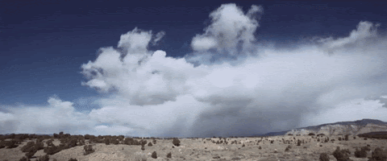
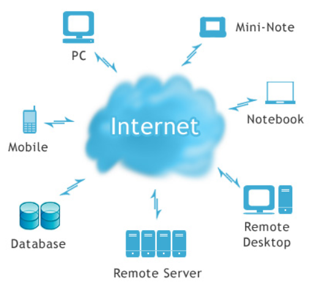

{target=_blank} 

# :material-cloud-braces: Introduction to Cloud Native Geospatial Formats

#### Instructors(s): 

[Tyson Lee Swetnam PhD](https://tysonswetnam.com/){target=_blank} {target=_blank},
[Carlos Lizárraga-Celaya PhD](https://github.com/carloslizarragac){target=_blank} {target=_blank},
[Jeffrey Gillan PhD](http://www.gillanscience.com){target=_blank} {target=_blank}

## About This Content
Welcome! This is an introductory course on Cloud Native Geospatial formats. Who is this course for?
  Here are the topics we will cover. 

* [Define the Cloud and Cloud Native Formats](#lets-use-the-cloud)
* [Why you should use Cloud Native Technologies](#why-cloud-native)
* Vector formats such as [GeoJSON](geojson.md)
* Raster formats such as [Cloud Optimized GeoTIFF (COG)](cog.md), [xarray](xarray.md), and [zarr](zarr.md)
* Point cloud format [Cloud Optimized Point Cloud (COPC)](copc.md)
* [SpatioTemporal Asset Catalogs (STAC)](stac.md)

 
Each topic will contain conceptual descriptions of the formats, as well as hands-on exercises to create, use, and share them. 

This website follows the [FAIR](https://www.go-fair.org/fair-principles/){target=_blank} and [CARE](https://www.gida-global.org/care){target=_blank} data principles and hopes to help further open science. 

### Helpful skills to have

* a basic understanding of the [Command Line Interface (UNIX)](https://swcarpentry.github.io/shell-novice/){target=_blank}
* a basic understanding of [Python3](https://www.geeksforgeeks.org/introduction-to-python3/#:~:text=Python%20is%20a%20high%2Dlevel,them%20readable%20all%20the%20time.){target=_blank}

## Let's Use the Cloud!
<figure markdown>
  { width="500" }
  <figcaption> The Cloud </figcaption>
</figure>

<figure markdown>
  { width="300" }
  <figcaption> </figcaption>
</figure>

<figure markdown>
  { width="500" }
  <figcaption> The Cloud </figcaption>
</figure>

<figure markdown>
  { width="200" }
  <figcaption> </figcaption>
</figure>

<figure markdown>
  { width="200" }
  <figcaption> </figcaption>
</figure>

<figure markdown>
  { width="200" }
  <figcaption> </figcaption>
</figure>

<figure markdown>
  { width="200" }
  <figcaption> </figcaption>
</figure>

## Why "cloud native"?

:material-cog: :material-layers-triple:   :material-vector-polyline:   :material-compass-rose:   :material-math-compass:   :material-map-clock: :material-map-marker:   :material-satellite-variant:   :material-airplane:   :material-drone:   :material-quadcopter:   :material-database-cog:   :material-graph-outline: 

There is a shift happening in the way we use Earth Observation System data to do research and management. Cloud data storage technologies have advanced at such a pace that we can now find and explore massive amounts of data via our web browser. At the same time online platforms with specialized software and hardware offer general data science and machine learning tools to explore these online datasets.

With these advances it is easier to foster collaborations, promote data-driven discovery, drive scientific innovation, increase transparency and improve reproducibility.

<figure markdown>
  <a href="https://github.com/tyson-swetnam/agic-2022/raw/main/assets/images/conventional.png" target="blank" rel="conventional">{ width="700" } </a>
    <figcaption> The old ways of receiving and working with GIS data. </figcaption>
</figure>

Many of us have been participants in "sneaker net" and "mail order" data delivery ordering and managing data transfers over physical media. These data are then processed on our workstations and laptop computers and ultimately put on external hard drives or uploaded back to national data services. GIS data have changed hands for years over conventional internet protocols (`https://`, `ftp://`, and newer `s3://`), where datasets are preferentially DOWNLOADED to our local compute resources and worked on.

"Cloud Native" means you are no longer looking to download all of your GIS data. Instead, we send our "code" and our execution tasks to the "Cloud" where the data are processed, and serviced over a variety of commercial cloud providers who are already hosting these large geospatial datasets (often free of cost to us).  Results can be viewed in the browser, or streamed in reduced formats back to our local computers.

<figure markdown>
  <a href="https://github.com/tyson-swetnam/agic-2022/raw/main/assets/images/cloud.png" target="blank" rel="cloud">{ width="700" } </a>
    <figcaption> The Cloudy way </figcaption>
</figure>

Cloud-native and "Analysis Ready Data" formats allow us to work with large datasets on the cloud easily and rather painlessly.

<a href="https://geojson.io" style="float:left" target="blank" rel="geojson">{ width="200" height="25" } </a>
<a href="https://stacspec.org" style="float:center" target="blank" rel="stac">{ width="200" height="25" } </a>
<a href="https://cogeo.org" style="float:right" target="blank" rel="cog">{ width="200" height="50" } </a> 

 

<a href="https://zarr.readthedocs.io" style="float:left" target="blank" rel="zarr">{ width="100" } </a>
<a href="https://docs.xarray.dev" style="float:center" target="blank" rel="xarray">{ width="200" } </a> 
<a href="https://copc.io" style="float:right" target="blank" rel="copc">{ width="200" } </a> 

## Open Architectures

The new approach to data sharing, focused on object storage rather than file downloads. This cloud platform approach is scalable and instead of moving data to processing systems near users as is the tradition, brings processing, computing, analytics and visualization to data – so called data proximate workbench capabilities, sometimes also referred to as server-side processing.

(Open Architecture for scalable cloud-based data analytics. From Abernathey, Ryan (2020): Data Access Modes in Science.)

---

## Resources  

[Cloud-Native Geospatial Outreach Event - April 2022 - from Open Geospatial Consortium (OGS)](https://www.youtube.com/watch?v=hprPIr9Vt4M&list=PLQsQNjNIDU87yUFyKy1seaiRps389RPwk){target=_blank}

[Mapscaping Podcast on Cloud Native Geospatial](https://mapscaping.com/podcast/cloud-native-geospatial/){target=_blank}

Gentemann, C. L., et al. (2021). “Science Storms the Cloud”. AGU Advances, 2, e2020AV000354. https://doi.org/10.1029/2020AV000354

Abernathey, R. P.  et al. (2021) "Cloud-Native Repositories for Big Scientific Data," in Computing in Science & Engineering, vol. 23, no. 2, pp. 26-35, 1 March-April 2021, https://doi.org/10.1109/MCSE.2021.3059437

